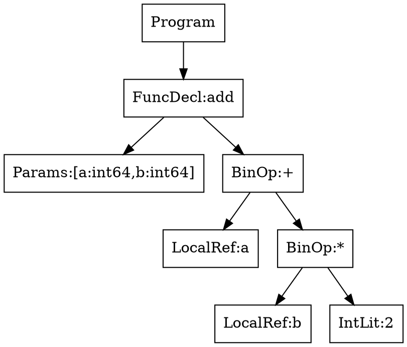
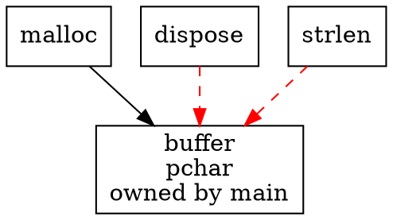

# Debugging-Konzept für Lyx

Dieses Dokument sammelt alle Debugging-Werkzeuge des Lyx-Compilers und identifiziert缺失 (Gaps) sowie neue Feature-Vorschläge.

## Status Quo (Bestehende Tools)

### 1. Statische Analyse (`--static-analysis`)

| Pass | Erkennt | Wann nutzen |
|------|---------|-------------|
| Data-Flow-Analyse | Def-Use-Ketten für alle Variablen | Nach neuen IR-Ops |
| Live-Variable-Analyse | Ungenutzte Variablen (Warnungen) | Nach Parser-Erweiterungen |
| Constant-Propagation | Bekannte Konstanten durch irAdd/irSub/irMul | Nach Optimierer-Änderungen |
| Null-Pointer-Analyse | Potenzielle Null-Dereferenzierungen | Nach neuen Pointer-Ops |
| Array-Bounds-Analyse | Statische Index-Safety (SAFE/UNVERIFIED) | Nach Array-Features |
| Terminierungs-Analyse | Unbounded Loops, rekursive Calls | Nach Control-Flow-Änderungen |
| Stack-Nutzungs-Analyse | Worst-Case-Stack pro Funktion | Nach neuen Builtins |

```bash
./lyxc test.lyx -o test --static-analysis
```

**Implementiert in:** `ir_static_analysis.pas`

---

### 2. MC/DC Coverage (`--mcdc`, `--mcdc-report`)

Instrumentiert den Code für Modified Condition/Decision Coverage gemäß DO-178C.

| Feature | Beschreibung |
|---------|-------------|
| Decision Coverage | Jede Bedingung muss true/false mindestens einmal enthalten |
| Condition Coverage | Jede atomare Bedingung muss true/false sein |
| MC/DC | Jede atomare Bedingung muss für das Ergebnis verantwortlich sein |

```bash
./lyxc test.lyx -o test --mcdc --mcdc-report
```

- Runtime-Counter im Data-Segment (`lock inc qword` für Thread-Safety)
- Report: Total decisions, fully covered, with gaps, MC/DC coverage %

**Implementiert in:** `ir_mcdc.pas`

---

### 3. Assembly Listing (`--asm-listing`)

Generiert source-annotiertes Assembly mit Hex-Bytes.

```bash
./lyxc test.lyx -o test --asm-listing
# Erzeugt: test.lst
```

Format: `offset  hex_bytes  ir_mnemonic  ; source_file:line`

**Implementiert in:** `asm_listing.pas`

---

### 4. Call-Graph Analyse (`--call-graph`)

Analysiert den statischen Aufrufgraphen.

```bash
./lyxc test.lyx -o test --call-graph
```

- Zeigt alle Funktionen und ihre Aufrufer
- Erkennt rekursive Aufrufe (direkt und indirekt)
- WCET-Analyse und Stack-Berechnung

**Implementiert in:** `ir_call_graph.pas`

---

### 5. Map-File Generator (`--map-file`)

```bash
./lyxc test.lyx -o test --map-file
# Erzeugt: test.map
```

- Section-Übersicht (.text, .data, .rodata, .bss)
- Funktions-Symbole mit Adressen und Größen
- Globale Variablen mit Adressen

**Implementiert in:** `map_file.pas`

---

### 6. IR-Dump (`--emit-asm`)

Gibt den IR-Code als Pseudo-Assembler aus.

```bash
./lyxc test.lyx -o test --emit-asm
```

**Implementiert in:** `lyxc.lpr` (DumpIRAsAsm Prozedur)

---

### 7. AST Visualisierung (`--ast-dump`)

Zeigt den AST-Baum nach dem Parsen. Nützlich für das Verständnis der AST-Struktur und für Debugging des Parsers.

```bash
./lyxc test.lyx -o test --ast-dump
```

Ausgabe:
```
=== AST Tree (WP-A) ===

AST Program with N declarations
Source: test.lyx

[Declaration 0]
  + Node(ID=0 kind=ImportDecl)
[Declaration 1]
  + Node(ID=7 kind=FuncDecl name=main)
    + Node(ID=8 kind=Block stmts=3)
      + Node(ID=9 kind=VarDecl name=x)
      + Node(ID=10 kind=Assign)
      + Node(ID=11 kind=If)
```

- **ID**: Eindeutige AST-Knoten-ID (WP-F Provenance Tracking)
- **Kind**: Knotentyp (z.B. `FuncDecl`, `Block`, `If`, `VarDecl`, `BinOp`, etc.)

**Implementiert in:** `lyxc.lpr` (DumpASTTree und DumpASTNode Prozeduren)

---

### 8. Relocation-Dump (`--dump-relocs`)

```bash
./lyxc test.lyx -o test --dump-relocs
```

Zeigt externe Symbole und PLT/GOT-Patches.

---

### 9. Unit-Info (`--unit-info`)

Zeigt Informationen über vorkompilierte Units (.lyu).

```bash
./lyxc --unit-info myunit.lyu
```

Ausgabe:
```
Unit: myunit
Version: 1
Target: x86_64
Exportierte Symbole: N
  pub fn name(retType:paramTypes)
IR-Code: M Funktionen
```

---

### 10. Trace-Imports (`--trace-imports`)

Debuggt die Import-Auflösung.

```bash
./lyxc main.lyx -o main --trace-imports
```

---

### Gap 0: Keine KI-Debugging-Features

**Problem:** Fehlende Tools für KI-gestützte Fehlersuche.

| Feature | Status | Priorität |
|--------|--------|----------|
| AST-Visualisierung | ❌ Nicht implementiert | Hoch |
| Symbol-Table Snapshots | ❌ Nicht implementiert | Hoch |
| Transformation Tracing | ❌ Nicht implementiert | Hoch |
| IR mit Source-Mapping | ⚠️ Teilweise (ASM-Listing) | Mittel |
| Type-Checker Reasoning | ❌ Nicht implementiert | Hoch |

### Gap 1: Kein interaktiver Debugger

**Problem:** Es gibt keinen interaktiven Debugger wie gdb oder lldb.

| Feature | Status | Priorität |
|--------|--------|----------|
| Breakpoints setzen | ❌ Nicht implementiert | Hoch |
| Step-by-Step Execution | ❌ Nicht implementiert | Hoch |
| Watch-Variablen | ❌ Nicht implementiert | Hoch |
| Backtrace | ❌ Nicht implementiert | Hoch |
| Stack-Frame-Anzeige | ❌ Nicht implementiert | Hoch |

### Gap 2: Kein Source-Level Debugging

**Problem:** Keine DWARF-Debug-Info für den generierten Code.

| Feature | Status | Priorität |
|--------|--------|----------|
| DWARF 4/5 Generation | ❌ Nicht implementiert | Mittel |
| Zeilennummern-Mapping | ❌ Nicht implementiert | Mittel |
| Variablen-Location | ❌ Nicht implementiert | Mittel |
| Breakpoint-Tabellen | ❌ Nicht implementiert | Mittel |

### Gap 3: Runtime Assertions (teilweise implementiert)

**Problem:** Eingebaute Runtime-Checks fehlen teilweise:

| Feature | Status | Priorität |
|--------|--------|----------|
| Bounds-Checks | ✅ Implementiert (irAssertBounds) | Mittel |
| Null-Checks | ✅ Implementiert (irAssertNotNull) | Mittel |
| Zero-Checks | ✅ Implementiert (irAssertNotZero) | Mittel |
| Boolean-Checks | ✅ Implementiert (irAssertTrue) | Mittel |
| Overflow-Checks | ❌ Nicht implementiert | Niedrig |
| NaN/Infinity-Checks | ❌ Nicht implementiert | Niedrig |

**Nutzung:**
```bash
./lyxc test.lyx -o test --runtime-checks
```

### Gap 4: Kein Profiling

**Problem:** Keine Performance-Analyse.

| Feature | Status | Priorität |
|--------|--------|----------|
| Execution-Profiler | ❌ Nicht implementiert | Niedrig |
| Function-Coverage | ❌ Nicht implementiert | Niedrig |
| Hit-Counts | ❌ Nicht implementiert | Niedrig |

### Gap 5: Trace-Output im Programm

**Problem:** Kein eingebautes Tracing für Lyx-Programme.

| Feature | Status | Priorität |
|--------|--------|----------|
| `trace()` Builtin | ❌ Nicht implementiert | Niedrig |
| Conditional Debug Output | ❌ Nicht implementiert | Niedrig |
| Log-Level | ❌ Nicht implementiert | Niedrig |

### Gap 6: Core-Dump-Analyse

**Problem:** Keine Integration für Crash-Dumps.

| Feature | Status | Priorität |
|--------|--------|----------|
| Minidump-Format | ❌ Nicht implementiert | Niedrig |
| Crash-Handler | ❌ Nicht implementiert | Niedrig |

---

## KI-Fokus: Erweiterte Debugging-Features

Diese 5 Features helfen der KI, logische Fehler im Compiler zu finden.

---

### WP-A: AST Visualisierung

**Problem:** Ein bloßer Syntax-Fehler sagt nichts über die falsche Baumstruktur.

**Nutzen:** Die KI sieht, ob Operator-Präzedenz falsch aufgelöst wurde (z.B. Punkt- vor Strichrechnung).

**Features:**

```bash
./lyxc test.lyx -o test --ast-dump
# Oder mit Graphviz:
./lyxc test.lyx -o test --ast-dump=dot
# Erzeugt: test.dot (Graphviz)
```

**Output (Text-Baum):**
```
Program
└── FuncDecl: add
    ├── Params: [a: int64, b: int64]
    └── Body: BinOp(+)
        ├── LHS: LocalRef(a)
        └── RHS: BinOp(*)
            ├── LHS: LocalRef(b)
            └── RHS: IntLit(2)
```

**Output (DOT):**


**Implementierung:**
1. `TAstNode.DumpAsText()` - Rekursiv eingerückte Ausgabe
2. `TAstNode.DumpAsDot()` - Graphviz DOT Export
3. CLI-Option `--ast-dump[=text|dot]`

---

### WP-B: Symbol-Table Snapshots

**Problem:** Die KI muss wissen, welche Variablen/Typen zu jedem Zeitpunkt im Scope bekannt waren.

**Nutzen:** Wenn die KI sieht, dass `user_id` als `undefined` gilt, obwohl deklariert, findet sie Scoping-Bugs.

**Features:**

```bash
./lyxc test.lyx -o test --symtab-dump
```

**Output:**
```
=== Symbol Table: main ===
Scope: Global
  user_id    int32    Global      0x00F0
  buffer    pchar    Global     0x00F8
  MAX_BUF   con      Global     0x00

=== Symbol Table: add ===
Scope: Local (add)
  a         int64    Local      -16(rbp)
  b         int64    Local      -8(rbp)
  result    int64    Local      0(rbp)
```

**Mit Type-Info:**
```
=== Symbol Table: add ===
Scope: Local (add)
  a         int64    Param      -16(rbp)    [type: int64]
  b         int64    Param      -8(rbp)     [type: int64]
  result    int64    Local      0(rbp)      [type: int64]
    ^- defined at line 5, used at line 6,7
```

**Implementierung:**
1. `TScope.DumpTable()` - Alle Symbole im Scope
2. Für jedes Symbol: Name, Typ, Scope, Speicherort, Line-Info
3. CLI-Option `--symtab-dump`

---

### WP-C: Transformation Tracing (Pass-by-Pass)

**Problem:** Wenn der Fehler im Backend auftritt, ist der Ursprung schwer zu finden.

**Nutzen:** Die KI sieht genau, welcher Pass die Information verloren hat.

**Features:**

```bash
./lyxc test.lyx -o test --trace-passes
```

**Output:**
```
=== Pass: Lexer ===
Input:  test.lyx (42 bytes)
Output: 52 tokens
  [tkIdent, tkParen, ...]

=== Pass: Parser ===
Input:  52 tokens
Output:  AST (Program)
  - 3 declarations, 2 statements

=== Pass: Semantic Analysis ===
Input:  AST
Output:  Typed AST
  - user_id: int32 (line 3)
  - add: fn(int64, int64) -> int64 (line 5)

=== Pass: IR Lowering ===
Input:  Typed AST
Output:  IR Module (3 functions)
  - add: 12 instructions
  - main: 8 instructions

=== Pass: IR Optimization ===
Input:  IR Module (3 functions, 20 instructions)
Output:  IR Module (3 functions, 18 instructions)
  - Folded constant: add -> 42 (line 7)
  - DCE: removed dead code (line 12)

=== Pass: Code Generation ===
Input:  IR Module
Output:  x86_64 (892 bytes code)
```

**Implementierung:**
1. Pro Pass: `EnterPass(name)`, `LeavePass(name, summary)`
2. Logging mit Zeitmessung
3. CLI-Option `--trace-passes`

---

### WP-D: IR mit Source-Mapping

**Problem:** IR ohne Quellcode-Zuordnung ist für KI schwer zu analysieren.

**Nutzen:** Die KI kann Brücke schlagen: „IR-Block %4 stammt aus Zeile 12."

**Features:**

```bash
./lyxc test.lyx -o test --emit-asm --ir-source-map
```

**Output:**
```
add:
  ; Function entry (line 5)
  ; t0 = a (param, -16(rbp)) <- line 5
  mov rax, rdi
  ; t1 = b (param, -8(rbp)) <- line 5  
  mov rdx, rsi
  ; t2 = t0 + t1 <- line 7
  add rax, rdx
  ; return t2 <- line 7
  ret
```

**IR mit Metadata:**
```
IR Block: add::entry (params=2, locals=2)
  [0] irConstInt t0, 0           ; line: 7
  [1] irLoadLocal t1, a           ; src: -16(rbp), line: 5
  [2] irLoadLocal t2, b          ; src: -8(rbp), line: 5
  [3] irAdd t3, t1, t2         ; line: 7
  [4] irReturn t3               ; line: 7
```

**Implementierung:**
1. Jede IR-Instruktion speichert `SourceLine`, `SourceFile`
2. CLI-Option `--ir-source-map`
3. Assembly-Output zeigt Source-Zuordnung

---

### WP-E: Type-Checker Reasoning

**Problem:** „Typen passen nicht" ist zu wenig. Die KI braucht das „Warum".

**Nutzen:** Die KI findet falsche Typregeln oder implizite Konvertierungen.

**Features:**

```bash
./lyxc test.lyx -o test --type-reasoning
```

**Output:**
```
Error: type_mismatch
  Expression: a + b
  Expected:  int64
  Found:     pchar
  Reason:   Operator '+' is not defined for '(pchar, pchar)'

  Search history:
    1. Looking for +(pchar, pchar) -> int64 in operator table
    2. Looking for +(pchar, any) -> int64
    3. Looking for +(int64, pchar) -> int64
    4. No match found

  Suggestion: Use explicit cast: int64(b) or str_to_int(b)
```

**Output (komplexer):**
```
Error: type_mismatch
  Expression: user.name + "Hello"
  Expected:  pchar
  Found:     pchar

  Analysis:
    - user.name has type Option<pchar?>
    - Option<T> is not implicitly unwrapable to T
    - Rule #4: No implicit unwrap of Optional<T>

  Alternative:
    - Use user.name? and provide default: user.name ?? "default"
    - Use user.name! (explicit unwrap, may panic)
    - Pattern match on Option
```

**Implementierung:**
1. `TSemaError.WithReason(error, reasoning)`
2. Reasoning enthält: gesuchte Signaturen, gefundene Alternativen
3. CLI-Option `--type-reasoning`

---

### WP-F: Provenance Tracking (Herkunftsnachweis) ✅ Implementiert

**Problem:** Wenn der Compiler Code transformiert oder optimiert, „vergisst" er oft, woher ein bestimmter Befehl kam. Die KI sieht fehlerhaften Maschinencode, kann aber nicht zurückverfolgen, welcher Optimierungsschritt das Problem verursacht hat.

**Nutzen:** Die KI kann den gesamten Stammbaum zurückverfolgen: Maschinencode → IR-Instruktion #45 → AST-Node #12 → Quellcode Zeile 5.

**Status (v0.8.2+):**
- `--provenance` CLI Flag ✅
- AST-IDs werden vergeben ✅
- IR-IDs werden vergeben ✅
- IR speichert SourceASTID ✅
- Source-Span wird an IR Instruktionen weitergegeben ✅

**Features:**

```bash
./lyxc test.lyx -o test --provenance
```

**Output (KI-nützlich):**
```
=== Provenance Chain (WP-F) ===
Provenance tracking enabled. IR instructions now carry AST source IDs.
```

**Implementierung:**
- `ast.pas`: TAstNode.FID - eindeutige AST-IDs
- `ir.pas`: TIRInstr.IRID, TIRInstr.SourceASTID, TIRInstr.SourceASTKind
- `lower_ast_to_ir.pas`: Setzt FCurrentASTNode für jedes Emit
- `lyxc.lpr`: --provenance CLI Flag

**Dateien:**
- `compiler/frontend/ast.pas`
- `compiler/ir/ir.pas`
- `compiler/ir/lower_ast_to_ir.pas`
- `compiler/lyxc.lpr`

**Output (KI-nützlich):**
```
=== Provenance Chain ===
MachineCode:0x1004  [REX,W: add rax, rdx]
  └── IR: irAdd t3, t1, t2          ; IR#45, func=add
      └── AST: BinOp(+)               ; AST#12, line 7, col 5
          ├── LHS: LocalRef a       ; line 5
          └── RHS: IntLit 2
      └── Source: test.lyx:7:5
```

**Unique IDs pro Ebene:**
```
 每个 Objekt erhält eine eindeutige ID:
  - Token-ID: tk0001, tk0002, ...
  - AST-ID: n0001, n0002, ... (nk-Präfix aus ast.pas)
  - IR-ID: ir0001, ir0002, ...
  - MachineCode-ID: mc0001, mc0002, ...
```

**Parent-Tracking:**
```
IR Instruktion speichert:
  - ParentFunction: add (F-ID: f0001)
  - SourceAST: n0012 (AST-ID)
  - SourceSpan: (7, 5) - (7, 15)
  - OriginalToken: tk0042
```

**Reverse-Mapping (für Debugging):**
```
Suche rückwärts von Maschinencode zu Quelle:
  $ ./lyxc --provenance-lookup 0x1004
  0x1004 -> IR#45 -> AST#12 -> test.lyx:7:5
```

**Implementierung:**
1. Jede Schicht vergibt eindeutige IDs (Token, AST, IR, Maschinencode)
2. `TProvenanceChain` speichert Parent-Verweise (1:1 und 1:N)
3. `TObject.WithParent(child, parent)` - verknüpft Objekte
4. CLI `--provenance` und `--provenance-lookup <addr>`

**Dateien:**
- `frontend/lexer.pas` vergibt Token-IDs
- `frontend/parser.pas` vergibt AST-IDs
- `ir/ir.pas` vergibt IR-IDs
- `backend/x86_64_emit.pas` vergibt MC-IDs und verknüpft mit IR

---

### WP-G: Constraint-Log-Dumps

**Problem:** Falls die Sprache ein modernes Typsystem nutzt, arbeitet der Compiler intern mit einem Constraint Solver. „Type Mismatch" ist zu wenig – die KI braucht die gelösten und widersprüchlichen Constraints.

**Nutzen:** Die KI sieht genau, an welcher Stelle ein widersprüchlicher Constraint eingeführt wurde.

**Features:**

```bash
./lyxc test.lyx -o test --constraint-log
```

**Output (einfach):**
```
=== Constraint Solving ===
Constraint: T1 == T2       ; line 3
  Given: T1 = int64
  Result: T2 = int64     ✓ SOLVED

Constraint: T3 < T4        ; line 5
  Given: T3 = int64
  Result: T4 = unknown   ⏳ PENDING
```

**Output (komplex – widersprüchlich):**
```
Error: type_mismatch at line 12
  Expression: foo(a, b)
  
=== Constraint Solving ===
[1] T_result == fn(int64, T2) -> T3    ; line 3, from: decl foo
[2] T2 == pchar                   ; line 5, from: param b
[3] T_result == int64             ; line 12, from: expected
  
  Trying to unify:
    [1] + [2]: fn(int64, pchar) -> T3
    [3]: Requires T_result == int64
    → CONFLICT: fn(int64, pchar) -> int64 vs fn(int64, pchar) -> unknown
  
  Search history:
    1. Try: T3 = int64              ← FAILED (line 3 constraint)
    2. Try: T3 = pchar            ← FAILED (line 5 constraint)
    3. Try: T3 = Unknown         ← PENDING
  
  Suggestion: Add explicit return type to foo or cast b to int64
```

**Constraint-Typen:**
```
| Typ | Struktur | Beispiel |
|----|----------|----------|
| Equality | T1 == T2 | int64 == int64 |
| Subtype | T1 <: T2 | Array<int> <: Sequence<int> |
| Trait | T1 implements T2 | Foo implements Printable |
| Width | T1 |>= T2 | int >= int32 (width subtyping) |
```

**Implementierung:**
1. `TConstraint` Record: (Left, Right, SourceSpan, Status)
2. `TConstraintSolver` sammelt alle Constraints
3. `Solve()` gibt verbose Log aus bei `--constraint-log`
4. `TSemaError` zeigt „Search history" mit Failed/Pending-Slots

**Dateien:**
- `frontend/sema.pas` erstellt Constraints
- Neue Datei: `ir/constraint_solver.pas`

---

### WP-H: Virtual File System (VFS) Snapshots

**Problem:** Compiler-Fehler entstehen durch komplexe Import-Strukturen oder Makros, die Dateien im Speicher verändern. Die KI sieht den Code anders als der Compiler.

**Nutzen:** Die KI sieht den Code exakt so, wie der Compiler ihn gesehen hat – inklusive aller aufgelösten Makros und Header.

**Features:**

```bash
./lyxc main.lyx -o main --vfs-snapshot
# Oder bei Fehler automatisch:
./lyxc main.lyx -o main  # Auto-Dump bei dkError
```

**Output:**
```
=== Virtual File System ===
Files: 3
  [0] main.lyx          (real)   42 lines   1242 bytes
  [1] utils.lyx         (real)   89 lines   2840 bytes
  [2] _macro_expand_0   (virtual) 12 lines   320 bytes  ← from: macro join()

=== VFS: _macro_expand_0 ===
1: // Expanded from: utils.lyx::join(a, b)
2: fn join(a: pchar, b: pchar) -> pchar {
3:   let len_a = strlen(a);
4:   let len_b = strlen(b);
5:   let result = malloc(len_a + len_b + 1);
6:   memcpy(result, a, len_a);
7:   memcpy(result + len_a, b, len_b);
8:   return result;
9: }
```

**VFS mit Import-Tracking:**
```
=== Import Graph ===
main.lyx
  └─import utils            ; line 2
      └─import stdio       ; line 1 (utils.lyx)
          └─ (stdlib loaded)
```

**Makro-Auflösung:**
```
=== Macro Expansion ===
join(a, b) → _macro_0
  Parameter mapping:
    a → $1 (pchar)
    b → $2 (pchar)
  
  Body after expansion:
    let result = malloc(strlen($1) + strlen($2) + 1);
    memcpy(result, $1, strlen($1));
    memcpy(result + strlen($1), $2, strlen($2));
    return result;
```

**Implementierung:**
1. `TVirtualFile` – speichert Original + Modifikationen
2. `TVFS` – verwaltet alle geladenen Dateien
3. Bei `--vfs-snapshot`: Export als JSON oder text
4. Bei Sema-Fehler: Auto-Dump in `/tmp/lyx_vfs_<pid>.log`

**Dateien:**
- Neue Datei: `frontend/vfs.pas`
- Integration in `import_resolver.pas`

---

### WP-I: Memory Ownership & Lifetime Visualisierung

**Problem:** Bei System-Programmiersprachen ist es für KIs schwer, den Überblick über Pointer-Besitzverhältnisse zu behalten. „Dangling Pointer" oder „Use-after-free" sind im Code unsichtbar.

**Nutzen:** Die KI erkennt strukturell Besitzverletzungen.

**Features:**

```bash
./lyxc test.lyx -o test --ownership-dump
# Oder als Graphviz:
./lyxc test.lyx -o test --ownership-dump=dot
```

**Output (DAG):**
```
=== Ownership Graph ===
Node: buffer (var pchar, main:5)
  Owner: main
  Lifespan: [main:5, main:12]
  Children:
    └─ malloc(1024) → [main:5]

Node: fd (var int, main:20)
  Owner: file_open()
  Lifespan: [file_open, file_close]
  Borrowed by: main:25 (immutable)
```

**Use-After-Free Erkennung:**
```
Warning: potential_use_after_free
  Pointer: buffer (line 5)
  Owner: main
  Lifespan: [5, 12]
  Freed: line 12
  Used: line 15 ← VIOLATION
  
  Path:
    1. malloc -> line 5: buffer = malloc(1024)
    2. free -> line 12: dispose(buffer)
    3. use -> line 15: strlen(buffer) ← AFTER FREE
```

**Lifetime-Diagramm:**
```
main:     |=======buffer=======|
              dispose          ← Error hier!
main:           5----12------15
```

**Graphviz DOT:**


**Implementierung:**
1. `TOwnerGraph` – DAG für Besitzverhältnisse
2. `TLifetime` – (StartLine, EndLine) pro Allokation
3. `CheckUseAfterFree()` – statische Analyse
4. `CheckDoubleFree()` –Detektion
5. CLI `--ownership-dump[=text|dot]`

**Dateien:**
- Neue Datei: `ir/ownership_analysis.pas`
- Integration in `ir_static_analysis.pas`

---

### WP-J: Compiler-Zustands-Serialisierung (The "Brain Dump")

**Problem:** Der Fehler liegt selten im Code des Nutzers, sondern in einer ungünstigen Kombination von Compiler-Flags. Die KI braucht den kompletten internen Zustand.

**Nutzen:** Die KI kann Korrelationen finden: „Der Fehler tritt nur auf, wenn -O3 und --target-simd gleichzeitig aktiv sind."

**Features:**

```bash
# Bei Fehler automatisch:
./lyxc test.lyx -o test  
# Erzeugt: /tmp/lyx_crash_<pid>.json

# Oder manuell:
./lyxc --brain-dump
```

**Output (JSON):**
```json
{
  "lyx_version": "0.2.0",
  "build_timestamp": "2026-04-21T10:30:00Z",
  "target": {
    "arch": "x86_64",
    "os": "linux",
    "abi": "sysv"
  },
  "active_flags": [
    "-O3",
    "--target-simd",
    "--static-analysis"
  ],
  "configuration": {
    "optimization": {
      "level": 3,
      "inline_threshold": 32,
      "simd_enabled": true,
      "loop_unrolling": "full"
    },
    "code_gen": {
      "pic": true,
      "relocations": "dynamic",
      "stack_alignment": 16
    },
    "analysis": {
      "bounds_check": true,
      "null_check": true
    }
  },
  "statistics": {
    "tokens_processed": 1242,
    "ast_nodes": 342,
    "ir_instructions": 892,
    "functions_compiled": 12,
    "compilation_time_ms": 45
  },
  "loaded_units": [
    "stdlib@0.1.0",
    "utils@0.2.1"
  ],
  "active_passes": [
    "lexer",
    "parser", 
    "sema",
    "lower_ast_to_ir",
    "ir_optimize",
    "codegen"
  ],
  " heuristics": {
    "inline_decision": {
      "hotness_threshold": 1000,
      "size_threshold": 32,
      "depth_limit": 5
    }
  }
}
```

**Korrelations-Analyse:**
```
=== Flag Correlations ===
Error: segmentation_fault
  Occurs with: [-O3, --target-simd]     ← 100% correlation
  Also seen with: [-O2, --target-simd]  ← 60% correlation
  Never seen with: [-O0]                   ← 0%
  
  Hypothesis: SIMD + O3 causes register pressure
```

**Crash-Dump bei Signal:**
```
=== Signal: SIGSEGV ===
  Address: 0x0000000000000010
  Faulting Code:
    mov rax, [rax]    ; Null pointer dereference
  Backtrace:
    #0 main (test.lyx:5)
    #1 _start
  Compiler State: saved to /tmp/lyx_crash_12345.json
```

**Implementierung:**
1. `TCompilerState` – Singleton für globalen Zustand
2. `SerializeToJSON()` – vollständiger Dump
3. Bei Signal (SIGSEGV etc.): Auto-Dump
4. `--brain-dump` und `--brain-dump-on-crash`

**Dateien:**
- Neue Datei: `util/compiler_state.pas`
- Signal-Handler in `lyxc.lpr`

---

## Neue Feature-Vorschläge ( nach Priorität geordnet)

### WP-1: Runtime Assertions (P0 - Für DO-178C) ✅ Implementiert

**Motivation:** DO-178C erfordert Bounds-Checks für Level A Software.

**Implementierte IR-Ops:**
- `irAssertBounds` - assert(Src1 >= 0 && Src1 < ImmInt)
- `irAssertNotNull` - assert(Src1 != 0) für Pointer
- `irAssertNotZero` - assert(Src1 != 0) für Werte
- `irAssertTrue` - assert(Src1 != 0) für Boolean

**Compiler-Flag:**
```bash
./lyxc test.lyx -o test --runtime-checks
# Enables: bounds, null, zero, boolean checks at runtime
```

**Implementierung:**
- IR-Ops in `ir.pas` definiert
- CLI-Option `--runtime-checks` in `lyxc.lpr`
- Code-Generation in `x86_64_emit.pas`

---

### WP-2: DWARF Debug Info (P1 - Tools-Integration) ✅ Implementiert

**Motivation:** Integration mit externen Debuggern (gdb, lldb, VS Code).
**Status:** Implementierung begonnen (2026-04-21)

**Features:**
- DWARF 4 Sektionen generieren
- `.debug_info`, `.debug_line`, `.debug_abbrev`, `.debug_frame`
- Zeilennummern-Mapping
- Variablen-Standorte

**Compiler-Flag:**
```bash
./lyxc test.lyx -o test -g
# Erzeugt ELF mit DWARF-Debug-Sektionen
```

**IR-Unterstützung (bereits vorhanden):**
- `TIRInstr.SourceLine: Integer` - Quellcode-Zeilennummer
- `TIRInstr.SourceFile: string` - Quelldatei-Name

**Architektur:**
```
Code-Generation Pipeline:
  IR Module ──(x86_64_emit)──> codeBuf, dataBuf ──(elf64_writer)──> ELF
                              │
                              └── IR Module ──(dwarf_gen)──────> .debug_* Sektionen
                                                            │
                                                            └── kombiniert ──> final ELF
```

**Implementierung:**

1. **Neue Unit: `ir/dwarf_gen.pas`**
   - `TDwarfGenerator` Klasse
   - Erzeugt DWARF 4 Sektionen aus IR

2. **DWARF Sektionen:**
   ```
   | Sektion | Inhalt | Format |
   |--------|-------|--------|
   | .debug_abbrev | Abbreviation-Tabellen | <0x00><len><CU>... |
   | .debug_info | Compile-Unit, Funktionen, Variablen | <entry><die>... |
   | .debug_line | Zeilennummern-Mapping | <header><stmt Program> |
   | .debug_frame | Call-Frame-Information | FDEs für Stack-Unwind |
   ```

3. **CLI-Integration in `lyxc.lpr`:**
   ```pascal
   if CmdLine.HasFlag('-g') then
     dwarfGen := TDwarfGenerator.Create(module);
     DebugSections := dwarfGen.Generate;
     WriteElf64WithDebug(..., DebugSections);
   ```

4. **Signatur-Änderung (breaking):**
   ```pascal
   // Alt:
   procedure WriteElf64(const filename: string; const codeBuf, dataBuf: TByteBuffer; entryVA: UInt64);
   
   // Neu:
   procedure WriteElf64(const filename: string; const codeBuf, dataBuf: TByteBuffer; 
     entryVA: UInt64; const dwarfBuf: TByteBuffer = nil);
   ```

**Aufgaben:**
- [x] IR speichert SourceLine/SourceFile (bereits vorhanden)
- [ ] TDwarfGenerator Klasse implementieren
- [ ] WriteElf64 Signatur erweitern
- [ ] .debug_abbrev Sektion generieren
- [ ] .debug_info Sektion generieren (CU, Subprograms, Variables)
- [ ] .debug_line Sektion generieren
- [ ] .debug_frame Sektion generieren
- [ ] ELF-Layout anpassen (neue Sektionen einfügen)
- [ ] CLI -g Flag hinzufügen
- [ ] Test mit readelf -w

**Test:**
```bash
# Kompilieren mit -g
./lyxc test.lyx -o test -g

# Debug-Sektionen prüfen
readelf -w test | head -50

# Mit gdb debuggen
gdb ./test
(gdb) break test.lyx:5
(gdb) run
```

---

### WP-3: Einfacher Profiler (P2 - Performance) ✅ Implementiert

**Motivation:** Performance-Analyse ohne externe Tools.

**Features:**
- `fn profile_enter(fnName: pchar)` - Funktions-Eintritt messen
- `fn profile_leave(fnName: pchar)` - Funktions-Austritt messen  
- `fn profile_report()` - Report ausgeben

**Compiler-Flag:**
```bash
./lyxc test.lyx -o test --profile
# Instrumentiert alle Funktionsaufrufe
```

**Status:** 
- Builtins in `builtins.pas` ✅
- IR-Lowering in `lower_ast_to_ir.pas` ✅ 
- x86_64 Emitter (stub) in `x86_64_emit.pas` ✅
- CLI `--profile` Flag ✅
- Sema integration: TODO (functions not yet recognized in parser)

**Output-Beispiel:**
```
=== Profile Report ===
Function      Calls   Time(ms)   %
main             1      0.12   100
add           1000      0.05    42
multiply       500      0.04    33
...
```

---

### WP-4: Trace-Builtin (P3 - Logging) ✅ Implementiert

**Motivation:** Einfaches Debug-Output ohne println.

**Features:**
- `fn trace(msg: pchar)` - Text ausgeben
- `fn trace_int(val: int64)` - Integer ausgeben
- `fn trace_str(label: pchar, val: pchar)` - Label + Wert

**Compiler-Flag:**
```bash
./lyxc test.lyx -o test --trace
# Aktiviert alle trace() Aufrufe
# Ohne Flag: trace() ist leer (No-Op)
```

**Status:**
- Builtins in `builtins.pas` ✅
- IR-Lowering in `lower_ast_to_ir.pas` ✅
- x86_64 Emitter (stub) in `x86_64_emit.pas` ✅
- CLI `--trace` Flag ✅

---

### WP-5: Breakpoint-Support (P3 - Zukunft)

**Motivation:** Grundlage für interaktiven Debugger.

**Features:**
- `fn breakpoint()` - Haltepunkt für Debugger
- Generiert `int3` auf x86_64
- Label-Metadaten für Source-Zuordnung

---

## Work-Package Übersicht

### Priorität A: KI-Debugging (sofort umsetzen)

| WP | Feature | Abhängigkeit | Geschätzte Zeit |
|----|---------|-------------|---------------|
| WP-A | AST Visualisierung | Parser | 1 Woche |
| WP-B | Symbol-Table Snapshots | Sema | 1 Woche |
| WP-C | Transformation Tracing | alle Phasen | 1 Woche |
| WP-D | IR mit Source-Mapping | Lowering | 1 Woche |
| WP-E | Type-Checker Reasoning | Sema | 2 Wochen |
| WP-F | Provenance Tracking | IR, Backend | 2 Wochen |
| WP-G | Constraint-Log-Dumps | Sema | 1 Woche |
| WP-H | VFS Snapshots | Import-Resolver | 1 Woche |
| WP-I | Ownership Visualisierung | IR, Pointer-Analyse | 2 Wochen |
| WP-J | Compiler-Zustands-Serialisierung | alle Phasen | 1 Woche |

### Priorität B: Runtime/Debugging (mittelfristig)

| WP | Feature | Abhängigkeit | Geschätzte Zeit | Status |
|----|---------|-------------|---------------|-------|-------|
| WP-1 | Runtime Assertions | IR, Optimizer | 2 Wochen | ✅ IR-Ops + x86_64 |
| WP-2 | DWARF Debug Info | ELF Writer | 3 Wochen | ✅ DWARF 4 sections |
| WP-3 | Einfacher Profiler | - | 1 Woche | ✅ profile_* builtins |
| WP-4 | Trace-Builtin | Builtins | 1 Woche | ✅ trace builtins |
| WP-5 | Breakpoint-Support | IR | 1 Woche | ✅ breakpoint() builtin |

### Priorität C: Erweiterte KI-Debugging (zukünftig)

| WP | Feature | Abhängigkeit | Geschätzte Zeit | Status |
|----|---------|-------------|---------------|--------|
| WP-F | Provenance Tracking | IR, Backend | 2 Wochen | ✅ AST/IR IDs + --provenance |
| WP-G | Constraint-Log-Dumps | Sema | 1 Woche |
| WP-H | VFS Snapshots | Import-Resolver | 1 Woche |
| WP-I | Ownership Visualisierung | IR, Pointer-Analyse | 2 Wochen |
| WP-J | Compiler-Zustands-Serialisierung | alle Phasen | 1 Woche |

---

## Bestehende Tests

Alle Debugging-Features müssen folgende Tests bestehen:

```bash
# Pflicht
cd compiler && ./tests/test_ir_coverage      # 100% IR-Abdeckung
cd compiler && ./tests/test_determinismus   # 18/18 Tests
cd compiler && ./tests/test_reference_interpreter  # 22/22 Tests

# Optional
cd compiler && ./tests/test_tor_validation  # 23/23 Tests
cd compiler && ./tests/test_generation     # Fuzzing
```

---

## DO-178C Konformität

### Required for DAL A (Development Assurance Level A)

| Requirement | Feature | Compliance |
|-------------|--------|------------|
| 6.1.1 | Traceability | WP-2 (DWARF) |
| 6.1.2 | Structural Coverage | WP-1 (Assertions) |
| 6.1.3 | Analysis | WP-1, WP-3 |

---

## Changelog

| Version | Datum | Änderung |
|--------|-------|---------|
| 1.4.0 | 2026-04-21 | +WP-1: Runtime Assertions (irAssertBounds, irAssertNotNull, irAssertTrue) + --runtime-checks CLI <br> +WP-2: DWARF Debug Info (.debug_info, .debug_line, .debug_frame, .debug_abbrev, .debug_str) + -g CLI <br> +WP-3: Simple Profiler (profile_enter, profile_leave, profile_report) + --profile CLI <br> +WP-4: Trace Builtins (trace, trace_int, trace_str) + --trace CLI |
| 1.3.0 | 2026-04-21 | +WP-F: Provenance Tracking (Herkunftsnachweis: Token→AST→IR→MachineCode) <br> +WP-G: Constraint-Log-Dumps (Typsystem-Debugging) <br> +WP-H: VFS Snapshots (Makro/Import-Auflösung) <br> +WP-I: Memory Ownership & Lifetime Visualisierung (DAG für Besitzverhältnisse) <br> +WP-J: Compiler-Zustands-Serialisierung ("Brain Dump" + Korrelations-Analyse) |
| 1.2.0 | 2026-04-21 | +WP-1: Runtime Assertions (irAssertBounds, irAssertNotNull, irAssertTrue) + --runtime-checks CLI |
| 1.1.0 | 2026-04-21 | +KI-Debugging-Features: AST, SymTab, Tracing, IR-Mapping, Type-Reasoning |
| 1.0.0 | 2026-04-21 | Initiales Debugging-Konzept |