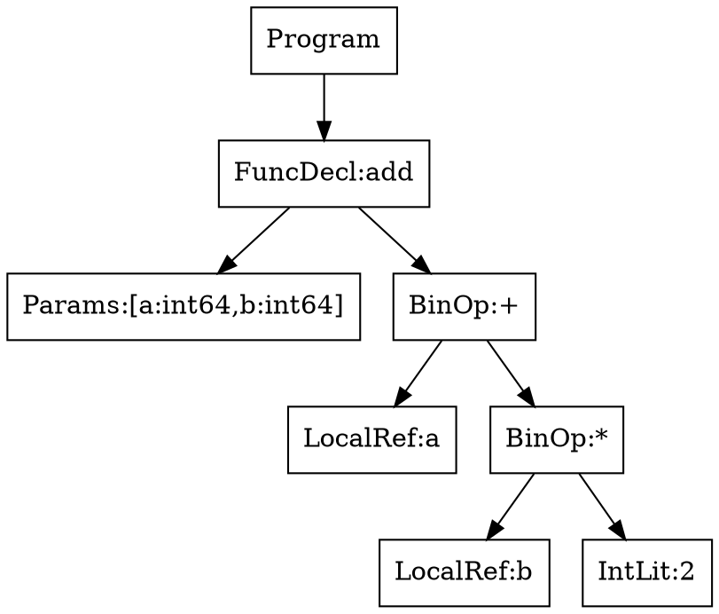

# Debugging-Konzept für Lyx

Dieses Dokument sammelt alle Debugging-Werkzeuge des Lyx-Compilers und identifiziert缺失 (Gaps) sowie neue Feature-Vorschläge.

## Status Quo (Bestehende Tools)

### 1. Statische Analyse (`--static-analysis`)

| Pass | Erkennt | Wann nutzen |
|------|---------|-------------|
| Data-Flow-Analyse | Def-Use-Ketten für alle Variablen | Nach neuen IR-Ops |
| Live-Variable-Analyse | Ungenutzte Variablen (Warnungen) | Nach Parser-Erweiterungen |
| Constant-Propagation | Bekannte Konstanten durch irAdd/irSub/irMul | Nach Optimierer-Änderungen |
| Null-Pointer-Analyse | Potenzielle Null-Dereferenzierungen | Nach neuen Pointer-Ops |
| Array-Bounds-Analyse | Statische Index-Safety (SAFE/UNVERIFIED) | Nach Array-Features |
| Terminierungs-Analyse | Unbounded Loops, rekursive Calls | Nach Control-Flow-Änderungen |
| Stack-Nutzungs-Analyse | Worst-Case-Stack pro Funktion | Nach neuen Builtins |

```bash
./lyxc test.lyx -o test --static-analysis
```

**Implementiert in:** `ir_static_analysis.pas`

---

### 2. MC/DC Coverage (`--mcdc`, `--mcdc-report`)

Instrumentiert den Code für Modified Condition/Decision Coverage gemäß DO-178C.

| Feature | Beschreibung |
|---------|-------------|
| Decision Coverage | Jede Bedingung muss true/false mindestens einmal enthalten |
| Condition Coverage | Jede atomare Bedingung muss true/false sein |
| MC/DC | Jede atomare Bedingung muss für das Ergebnis verantwortlich sein |

```bash
./lyxc test.lyx -o test --mcdc --mcdc-report
```

- Runtime-Counter im Data-Segment (`lock inc qword` für Thread-Safety)
- Report: Total decisions, fully covered, with gaps, MC/DC coverage %

**Implementiert in:** `ir_mcdc.pas`

---

### 3. Assembly Listing (`--asm-listing`)

Generiert source-annotiertes Assembly mit Hex-Bytes.

```bash
./lyxc test.lyx -o test --asm-listing
# Erzeugt: test.lst
```

Format: `offset  hex_bytes  ir_mnemonic  ; source_file:line`

**Implementiert in:** `asm_listing.pas`

---

### 4. Call-Graph Analyse (`--call-graph`)

Analysiert den statischen Aufrufgraphen.

```bash
./lyxc test.lyx -o test --call-graph
```

- Zeigt alle Funktionen und ihre Aufrufer
- Erkennt rekursive Aufrufe (direkt und indirekt)
- WCET-Analyse und Stack-Berechnung

**Implementiert in:** `ir_call_graph.pas`

---

### 5. Map-File Generator (`--map-file`)

```bash
./lyxc test.lyx -o test --map-file
# Erzeugt: test.map
```

- Section-Übersicht (.text, .data, .rodata, .bss)
- Funktions-Symbole mit Adressen und Größen
- Globale Variablen mit Adressen

**Implementiert in:** `map_file.pas`

---

### 6. IR-Dump (`--emit-asm`)

Gibt den IR-Code als Pseudo-Assembler aus.

```bash
./lyxc test.lyx -o test --emit-asm
```

**Implementiert in:** `lyxc.lpr` (DumpIRAsAsm Prozedur)

---

### 7. Relocation-Dump (`--dump-relocs`)

```bash
./lyxc test.lyx -o test --dump-relocs
```

Zeigt externe Symbole und PLT/GOT-Patches.

---

### 8. Unit-Info (`--unit-info`)

Zeigt Informationen über vorkompilierte Units (.lyu).

```bash
./lyxc --unit-info myunit.lyu
```

Ausgabe:
```
Unit: myunit
Version: 1
Target: x86_64
Exportierte Symbole: N
  pub fn name(retType:paramTypes)
IR-Code: M Funktionen
```

---

### 9. Trace-Imports (`--trace-imports`)

Debuggt die Import-Auflösung.

```bash
./lyxc main.lyx -o main --trace-imports
```

---

### Gap 0: Keine KI-Debugging-Features

**Problem:** Fehlende Tools für KI-gestützte Fehlersuche.

| Feature | Status | Priorität |
|--------|--------|----------|
| AST-Visualisierung | ❌ Nicht implementiert | Hoch |
| Symbol-Table Snapshots | ❌ Nicht implementiert | Hoch |
| Transformation Tracing | ❌ Nicht implementiert | Hoch |
| IR mit Source-Mapping | ⚠️ Teilweise (ASM-Listing) | Mittel |
| Type-Checker Reasoning | ❌ Nicht implementiert | Hoch |

### Gap 1: Kein interaktiver Debugger

**Problem:** Es gibt keinen interaktiven Debugger wie gdb oder lldb.

| Feature | Status | Priorität |
|--------|--------|----------|
| Breakpoints setzen | ❌ Nicht implementiert | Hoch |
| Step-by-Step Execution | ❌ Nicht implementiert | Hoch |
| Watch-Variablen | ❌ Nicht implementiert | Hoch |
| Backtrace | ❌ Nicht implementiert | Hoch |
| Stack-Frame-Anzeige | ❌ Nicht implementiert | Hoch |

### Gap 2: Kein Source-Level Debugging

**Problem:** Keine DWARF-Debug-Info für den generierten Code.

| Feature | Status | Priorität |
|--------|--------|----------|
| DWARF 4/5 Generation | ❌ Nicht implementiert | Mittel |
| Zeilennummern-Mapping | ❌ Nicht implementiert | Mittel |
| Variablen-Location | ❌ Nicht implementiert | Mittel |
| Breakpoint-Tabellen | ❌ Nicht implementiert | Mittel |

### Gap 3: Runtime Assertions (teilweise implementiert)

**Problem:** Eingebaute Runtime-Checks fehlen teilweise:

| Feature | Status | Priorität |
|--------|--------|----------|
| Bounds-Checks | ✅ Implementiert (irAssertBounds) | Mittel |
| Null-Checks | ✅ Implementiert (irAssertNotNull) | Mittel |
| Zero-Checks | ✅ Implementiert (irAssertNotZero) | Mittel |
| Boolean-Checks | ✅ Implementiert (irAssertTrue) | Mittel |
| Overflow-Checks | ❌ Nicht implementiert | Niedrig |
| NaN/Infinity-Checks | ❌ Nicht implementiert | Niedrig |

**Nutzung:**
```bash
./lyxc test.lyx -o test --runtime-checks
```

### Gap 4: Kein Profiling

**Problem:** Keine Performance-Analyse.

| Feature | Status | Priorität |
|--------|--------|----------|
| Execution-Profiler | ❌ Nicht implementiert | Niedrig |
| Function-Coverage | ❌ Nicht implementiert | Niedrig |
| Hit-Counts | ❌ Nicht implementiert | Niedrig |

### Gap 5: Trace-Output im Programm

**Problem:** Kein eingebautes Tracing für Lyx-Programme.

| Feature | Status | Priorität |
|--------|--------|----------|
| `trace()` Builtin | ❌ Nicht implementiert | Niedrig |
| Conditional Debug Output | ❌ Nicht implementiert | Niedrig |
| Log-Level | ❌ Nicht implementiert | Niedrig |

### Gap 6: Core-Dump-Analyse

**Problem:** Keine Integration für Crash-Dumps.

| Feature | Status | Priorität |
|--------|--------|----------|
| Minidump-Format | ❌ Nicht implementiert | Niedrig |
| Crash-Handler | ❌ Nicht implementiert | Niedrig |

---

## KI-Fokus: Erweiterte Debugging-Features

Diese 5 Features helfen der KI, logische Fehler im Compiler zu finden.

---

### WP-A: AST Visualisierung

**Problem:** Ein bloßer Syntax-Fehler sagt nichts über die falsche Baumstruktur.

**Nutzen:** Die KI sieht, ob Operator-Präzedenz falsch aufgelöst wurde (z.B. Punkt- vor Strichrechnung).

**Features:**

```bash
./lyxc test.lyx -o test --ast-dump
# Oder mit Graphviz:
./lyxc test.lyx -o test --ast-dump=dot
# Erzeugt: test.dot (Graphviz)
```

**Output (Text-Baum):**
```
Program
└── FuncDecl: add
    ├── Params: [a: int64, b: int64]
    └── Body: BinOp(+)
        ├── LHS: LocalRef(a)
        └── RHS: BinOp(*)
            ├── LHS: LocalRef(b)
            └── RHS: IntLit(2)
```

**Output (DOT):**


**Implementierung:**
1. `TAstNode.DumpAsText()` - Rekursiv eingerückte Ausgabe
2. `TAstNode.DumpAsDot()` - Graphviz DOT Export
3. CLI-Option `--ast-dump[=text|dot]`

---

### WP-B: Symbol-Table Snapshots

**Problem:** Die KI muss wissen, welche Variablen/Typen zu jedem Zeitpunkt im Scope bekannt waren.

**Nutzen:** Wenn die KI sieht, dass `user_id` als `undefined` gilt, obwohl deklariert, findet sie Scoping-Bugs.

**Features:**

```bash
./lyxc test.lyx -o test --symtab-dump
```

**Output:**
```
=== Symbol Table: main ===
Scope: Global
  user_id    int32    Global      0x00F0
  buffer    pchar    Global     0x00F8
  MAX_BUF   con      Global     0x00

=== Symbol Table: add ===
Scope: Local (add)
  a         int64    Local      -16(rbp)
  b         int64    Local      -8(rbp)
  result    int64    Local      0(rbp)
```

**Mit Type-Info:**
```
=== Symbol Table: add ===
Scope: Local (add)
  a         int64    Param      -16(rbp)    [type: int64]
  b         int64    Param      -8(rbp)     [type: int64]
  result    int64    Local      0(rbp)      [type: int64]
    ^- defined at line 5, used at line 6,7
```

**Implementierung:**
1. `TScope.DumpTable()` - Alle Symbole im Scope
2. Für jedes Symbol: Name, Typ, Scope, Speicherort, Line-Info
3. CLI-Option `--symtab-dump`

---

### WP-C: Transformation Tracing (Pass-by-Pass)

**Problem:** Wenn der Fehler im Backend auftritt, ist der Ursprung schwer zu finden.

**Nutzen:** Die KI sieht genau, welcher Pass die Information verloren hat.

**Features:**

```bash
./lyxc test.lyx -o test --trace-passes
```

**Output:**
```
=== Pass: Lexer ===
Input:  test.lyx (42 bytes)
Output: 52 tokens
  [tkIdent, tkParen, ...]

=== Pass: Parser ===
Input:  52 tokens
Output:  AST (Program)
  - 3 declarations, 2 statements

=== Pass: Semantic Analysis ===
Input:  AST
Output:  Typed AST
  - user_id: int32 (line 3)
  - add: fn(int64, int64) -> int64 (line 5)

=== Pass: IR Lowering ===
Input:  Typed AST
Output:  IR Module (3 functions)
  - add: 12 instructions
  - main: 8 instructions

=== Pass: IR Optimization ===
Input:  IR Module (3 functions, 20 instructions)
Output:  IR Module (3 functions, 18 instructions)
  - Folded constant: add -> 42 (line 7)
  - DCE: removed dead code (line 12)

=== Pass: Code Generation ===
Input:  IR Module
Output:  x86_64 (892 bytes code)
```

**Implementierung:**
1. Pro Pass: `EnterPass(name)`, `LeavePass(name, summary)`
2. Logging mit Zeitmessung
3. CLI-Option `--trace-passes`

---

### WP-D: IR mit Source-Mapping

**Problem:** IR ohne Quellcode-Zuordnung ist für KI schwer zu analysieren.

**Nutzen:** Die KI kann Brücke schlagen: „IR-Block %4 stammt aus Zeile 12."

**Features:**

```bash
./lyxc test.lyx -o test --emit-asm --ir-source-map
```

**Output:**
```
add:
  ; Function entry (line 5)
  ; t0 = a (param, -16(rbp)) <- line 5
  mov rax, rdi
  ; t1 = b (param, -8(rbp)) <- line 5  
  mov rdx, rsi
  ; t2 = t0 + t1 <- line 7
  add rax, rdx
  ; return t2 <- line 7
  ret
```

**IR mit Metadata:**
```
IR Block: add::entry (params=2, locals=2)
  [0] irConstInt t0, 0           ; line: 7
  [1] irLoadLocal t1, a           ; src: -16(rbp), line: 5
  [2] irLoadLocal t2, b          ; src: -8(rbp), line: 5
  [3] irAdd t3, t1, t2         ; line: 7
  [4] irReturn t3               ; line: 7
```

**Implementierung:**
1. Jede IR-Instruktion speichert `SourceLine`, `SourceFile`
2. CLI-Option `--ir-source-map`
3. Assembly-Output zeigt Source-Zuordnung

---

### WP-E: Type-Checker Reasoning

**Problem:** „Typen passen nicht" ist zu wenig. Die KI braucht das „Warum".

**Nutzen:** Die KI findet falsche Typregeln oder implizite Konvertierungen.

**Features:**

```bash
./lyxc test.lyx -o test --type-reasoning
```

**Output:**
```
Error: type_mismatch
  Expression: a + b
  Expected:  int64
  Found:     pchar
  Reason:   Operator '+' is not defined for '(pchar, pchar)'

  Search history:
    1. Looking for +(pchar, pchar) -> int64 in operator table
    2. Looking for +(pchar, any) -> int64
    3. Looking for +(int64, pchar) -> int64
    4. No match found

  Suggestion: Use explicit cast: int64(b) or str_to_int(b)
```

**Output (komplexer):**
```
Error: type_mismatch
  Expression: user.name + "Hello"
  Expected:  pchar
  Found:     pchar

  Analysis:
    - user.name has type Option<pchar?>
    - Option<T> is not implicitly unwrapable to T
    - Rule #4: No implicit unwrap of Optional<T>

  Alternative:
    - Use user.name? and provide default: user.name ?? "default"
    - Use user.name! (explicit unwrap, may panic)
    - Pattern match on Option
```

**Implementierung:**
1. `TSemaError.WithReason(error, reasoning)`
2. Reasoning enthält: gesuchte Signaturen, gefundene Alternativen
3. CLI-Option `--type-reasoning`

---

## Neue Feature-Vorschläge ( nach Priorität geordnet)

### WP-1: Runtime Assertions (P0 - Für DO-178C) ✅ Implementiert

**Motivation:** DO-178C erfordert Bounds-Checks für Level A Software.

**Implementierte IR-Ops:**
- `irAssertBounds` - assert(Src1 >= 0 && Src1 < ImmInt)
- `irAssertNotNull` - assert(Src1 != 0) für Pointer
- `irAssertNotZero` - assert(Src1 != 0) für Werte
- `irAssertTrue` - assert(Src1 != 0) für Boolean

**Compiler-Flag:**
```bash
./lyxc test.lyx -o test --runtime-checks
# Enables: bounds, null, zero, boolean checks at runtime
```

**Implementierung:**
- IR-Ops in `ir.pas` definiert
- CLI-Option `--runtime-checks` in `lyxc.lpr`
- Code-Generation in `x86_64_emit.pas`

---

### WP-2: DWARF Debug Info (P1 - Tools-Integration)

**Motivation:** Integration mit externen Debuggern (gdb, lldb, VS Code).

**Features:**
- DWARF 4 Sektionen generieren
- `.debug_info`, `.debug_line`, `.debug_abbrev`, `.debug_frame`
- Zeilennummern-Mapping
- Variablen-Standorte

**Compiler-Flag:**
```bash
./lyxc test.lyx -o test -g
# Erzeugt ELF mit DWARF-Debug-Sektionen
```

**Implementierung:**
1. DWARF-Tabellen in `elf64_writer.pas`
2. Source-Line-Mapping speichern
3. Lokal/Param-Offset für Variablen

---

### WP-3: Einfacher Profiler (P2 - Performance)

**Motivation:** Performance-Analyse ohne externe Tools.

**Features:**
- `fn profile_enter(fnName: pchar)` - Funktions-Eintritt messen
- `fn profile_leave(fnName: pchar)` - Funktions-Austritt messen
- `fn profile_report()` - Report ausgeben

**Compiler-Flag:**
```bash
./lyxc test.lyx -o test --profile
# Instrumentiert alle Funktionsaufrufe
```

**Output-Beispiel:**
```
=== Profile Report ===
Function      Calls   Time(ms)   %
main             1      0.12   100
add           1000      0.05    42
multiply       500      0.04    33
...
```

---

### WP-4: Trace-Builtin (P3 - Logging)

**Motivation:** Einfaches Debug-Output ohne println.

**Features:**
- `fn trace(msg: pchar)` - Text ausgeben
- `fn trace_int(val: int64)` - Integer ausgeben
- `fn trace_str(label: pchar, val: pchar)` - Label + Wert

**Compiler-Flag:**
```bash
./lyxc test.lyx -o test --trace
# Aktiviert alle trace() Aufrufe
# Ohne Flag: trace() ist leer (No-Op)
```

---

### WP-5: Breakpoint-Support (P3 - Zukunft)

**Motivation:** Grundlage für interaktiven Debugger.

**Features:**
- `fn breakpoint()` - Haltepunkt für Debugger
- Generiert `int3` auf x86_64
- Label-Metadaten für Source-Zuordnung

---

## Work-Package Übersicht

### Priorität A: KI-Debugging (sofort umsetzen)

| WP | Feature | Abhängigkeit | Geschätzte Zeit |
|----|---------|-------------|---------------|
| WP-A | AST Visualisierung | Parser | 1 Woche |
| WP-B | Symbol-Table Snapshots | Sema | 1 Woche |
| WP-C | Transformation Tracing | alle Phasen | 1 Woche |
| WP-D | IR mit Source-Mapping | Lowering | 1 Woche |
| WP-E | Type-Checker Reasoning | Sema | 2 Wochen |

### Priorität B: Runtime/Debugging (mittelfristig)

| WP | Feature | Abhängigkeit | Geschätzte Zeit | Status |
|----|---------|-------------|---------------|-------|
| WP-1 | Runtime Assertions | IR, Optimizer | 2 Wochen | ✅ IR-Ops + x86_64 |
| WP-2 | DWARF Debug Info | ELF Writer | 3 Wochen | - |
| WP-3 | Einfacher Profiler | - | 1 Woche | - |
| WP-4 | Trace-Builtin | Builtins | 1 Woche | - |
| WP-5 | Breakpoint-Support | IR | 1 Woche | - |

---

## Bestehende Tests

Alle Debugging-Features müssen folgende Tests bestehen:

```bash
# Pflicht
cd compiler && ./tests/test_ir_coverage      # 100% IR-Abdeckung
cd compiler && ./tests/test_determinismus   # 18/18 Tests
cd compiler && ./tests/test_reference_interpreter  # 22/22 Tests

# Optional
cd compiler && ./tests/test_tor_validation  # 23/23 Tests
cd compiler && ./tests/test_generation     # Fuzzing
```

---

## DO-178C Konformität

### Required for DAL A (Development Assurance Level A)

| Requirement | Feature | Compliance |
|-------------|--------|------------|
| 6.1.1 | Traceability | WP-2 (DWARF) |
| 6.1.2 | Structural Coverage | WP-1 (Assertions) |
| 6.1.3 | Analysis | WP-1, WP-3 |

---

## Changelog

| Version | Datum | Änderung |
|---------|-------|---------|
| 1.2.0 | 2026-04-21 | +WP-1: Runtime Assertions (irAssertBounds, irAssertNotNull, irAssertTrue) + --runtime-checks CLI |
| 1.1.0 | 2026-04-21 | +KI-Debugging-Features: AST, SymTab, Tracing, IR-Mapping, Type-Reasoning |
| 1.0.0 | 2026-04-21 | Initiales Debugging-Konzept |